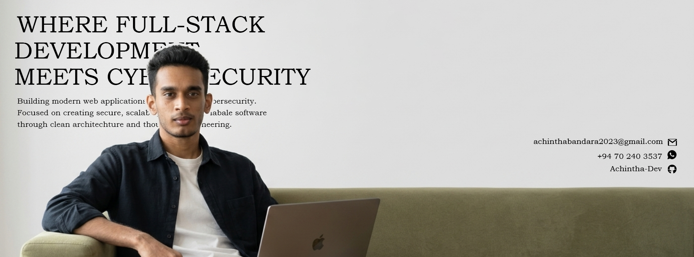
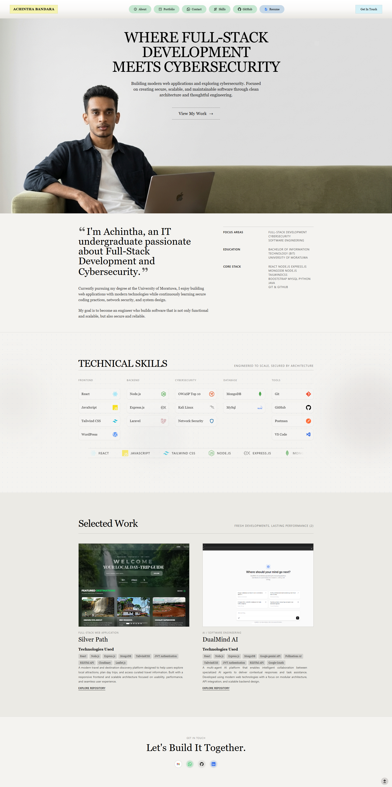

# Personal Portfolio Website



<p align='center'>
  
    
    
    
    
    
    
    
    
    
    
    
    
    
</p>

A modern and responsive portfolio website showcasing my projects, technical skills, and journey in Full-Stack Development and Cybersecurity.

## Live Demo

🔗 Portfolio: portfolio-website-henna-mu-17.vercel.app

## Preview

<div align='center'>
    
</div>

## Features

- Responsive design
- Dark and Light mode support
- Project showcase section
- Resume page with PDF download
- Contact section
- Modern and clean UI

## Tech Stack

Frontend:
- React
- Vite
- Tailwind CSS

Tools:
- Git
- GitHub
- Vercel

## Installation
Clone the repository

```bash
git clone https://github.com/Achintha-Dev/portfolio-website.git
cd client
npm install
npm run dev
```
---

## Why I Built This

### About This Project
```md

This portfolio was designed and developed to showcase my work, technical skills, and learning journey in Full-Stack Development and Cybersecurity. The website emphasizes clean design, responsiveness, accessibility, and modern web development practices.

```
## Featured Projects

### Silver Path
A full-stack web application built using React, Node.js, Express, and MongoDB. Designed with a responsive user interface and scalable backend architecture to deliver a seamless user experience.

### DualMind AI
A multi-agent AI platform that coordinates specialized AI agents to provide contextual task assistance. Built with a focus on modular architecture, API integration, and maintainable code design.

## Highlights

- Responsive Design
- Dark / Light Mode
- React + Tailwind CSS
- Resume Download Feature
- Project Showcase
- Modern Minimalist UI

## Author

Achintha Bandara

GitHub:
https://github.com/Achintha-Dev

LinkedIn:
https://linkedin.com/in/your-linkedin-profile